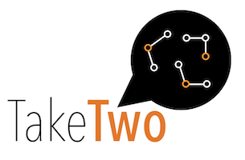
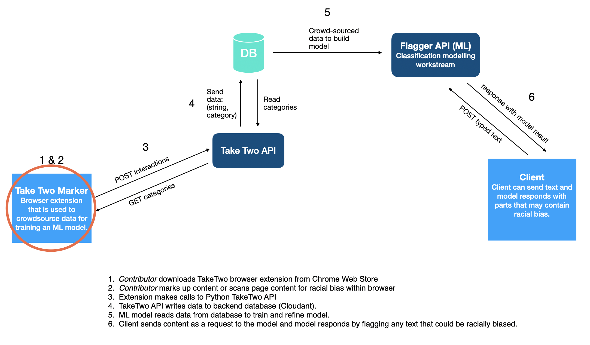
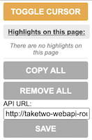
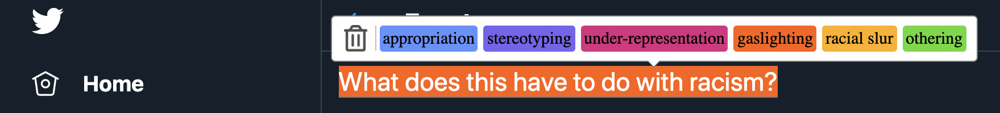
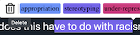
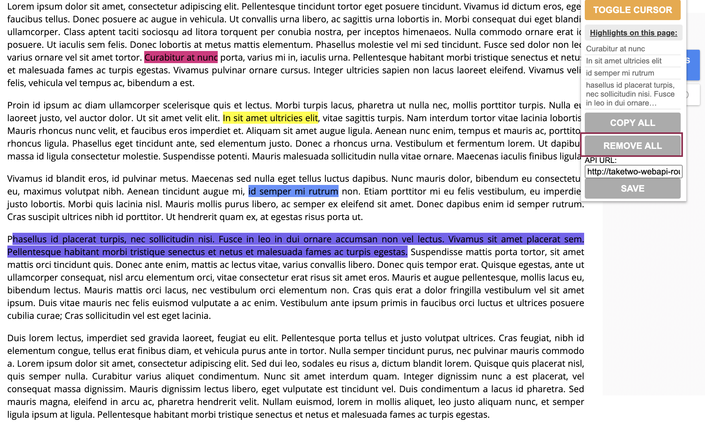

[TakeTwo Website](https://w3.ibm.com/w3publisher/take-two)
 
[TakeTwo Video (Password Needed)](https://vimeo.com/453095359)

## Emb(race): Diverse Representation

Technology has the power to drive action. And right now, a call to action is needed to eradicate racism. **Black lives matter.**

We recognize technology alone cannot fix hundreds of years of racial injustice and inequality, but when we put it in the hands of the Black community and their supporters, technology can begin to bridge a gap. To start a dialogue. To identify areas where technology can help pave a road to progress.

This is one of three open source projects underway as part of the [Call for Code Emb(race) Spot Challenge](https://github.com/topics/embrace-call-for-code) led by contributors from IBM and Red Hat.

 

### Problem Statement

*Bias is learned and perpetuated in different ways (e.g. societal beliefs, misrepresentation, ignorance) that consequently create inequitable outcomes across all spheres of life.*

This repo is part of the [Embrace: Diverse Representation](https://github.com/Call-for-Code/Embrace-Diverse-Representation) stream and our focus is on problem statement 3. We decided to focus on the following two predefined hills:

1. A media content editor (e.g., audio, gaming, movies, tv, comics, news, publications) can incorporate bias detection and remediation into their creative process to reduce racial bias and improve representation to Gen Z.

2. A social media user can understand the historical and societal context of racial bias and cultural appropriation reflected in their posts in real time.

We have identified the following issues currently faced by **content consumers**:

- Racially biased posts that are hurtful and trigger a negative emotional response.
- Tired of seeing racially biased posts on social media channels and in environments like online forums (e.g gaming).
- Lack of content which is fairly representative.

This project aims to facilitate **content consumers** to:

- Contribute to a crowdsourced dataset of racially biased terms that can be used to eliminate racial bias from content platforms. 
- Speed removal of racially biased and offensive language from online mediums. 
- Help content platforms diversify content and understand how to make their content more inclusive.

 

## Description of the TakeTwo Project

The TakeTwo solution provides a quick and simple tool for **content platforms** to detect and eliminate racial bias (both overt and subtle) from their content. 

This is underpinned by a crowd-sourced database of words and phrases that are deemed racially biased. These phrases are categorized in order to train an AI model on the significance of the context in which the language was used. Contributors to the project can be part of the crowdsourcing process by installing a browser extension. This repository is the Chrome extension that can be used to facilitate the data capture process, which is used for modelling. 

There are a number of other repositories related to this project:

- [TakeTwo API](https://github.com/embrace-call-for-code/taketwo-marker-chromeextension) - Code for the Chrome extension used to crowdsource data for training the ML model. 
- [TakeTwo Data Science](https://github.com/embrace-call-for-code/taketwo-api) - Contains data science work for building and training the model.

 

## Technology Used

This is a javascript extension. 

This extension uses the [Highlighter chrome extension](https://github.com/jeromepl/highlighter) library as a basis in order to allow the highlighter functionality for selecting text. 

### TakeTwo Architecture

This Chrome extension (highlighted in the following diagram) is part of the Call For Code TakeTwo Project. This extension is used to enable the crowdsourcing of data for use in training an ML model. This extension aims to make it as easy as possible for content consumers who would like to contribute to this initiative to do so quickly and privately. 

 

## Description of TakeTwo Chrome Extension

One of the issues that was identified early on in trying to build a model that can detect racial bias, was the lack of a data on racially biased words and phrases. 

The TakeTwo Chrome browser extension is a plugin to facilitate crowdsourcing words and phrases that could be racially biased. The words and phrases can be categorised. The categories are defined in our [API](https://github.com/embrace-call-for-code/taketwo-webapi). 

The words and phrases, along with their category, are sent to a backend database via an API. The data is used to train an ML text classification model on the significance of the context in which the language was used. 

Contributors to the project can be part of the crowdsourcing process by installing a browser extension.

### Data

The Chrome extension sends the following data to a backend database via an API: 

- ``"flagged_string"``: *The word of phrase that has been highlighted by the user.*
- ``"category"``: *The category that has been selected for the type of racial bias present in the highlighted word or phrase.*
- ``"url"``: *The url from where the word or phrase was highlighted.*

 

This project has defined a number of categories of racial bias, which are used by a text classification model (outlined below), however we welcome feedback on these:

- Appropriation
- Stereotyping
- Under-Representation
- Gaslighting
- Racial Slur
- Othering

Definitions of these categories can be found on the TakeTwo webpage. 

 

## Try out the extension

The following steps will explain how to get started with this extension.

### 1. Install the TakeTwo chrome extension

You will need the chrome browser, which can be installed [here](https://www.google.co.uk/chrome/?brand=CHBD&gclid=Cj0KCQjwjer4BRCZARIsABK4QeVAQkotXkLJlBvJS2V7R2q9__Gk3PchSyhorcBNAZXx7JJwbDeRrBYaAk3TEALw_wcB&gclsrc=aw.ds). 

In the future we hope this extension will be available via the chrome store, however for now you will need to install from a local directory. 

- Clone this git repo. 
- In order to install the chrome plugin, navigate to `chrome://extensions` and then select the **load unpacked** option. 
- Navigate to the repo folder and `select`. You will now have the browser plug-in available to you. 

### 2. Highlight text

When in webpage content where you find racially biased words or phrases that are not already highlighted, highlight and categorise them as follows:

- Click on the plugin icon in the top right Chrome toolbar. 
- Click on 'Toggle cursor' to enter highlight mode, your pointer will show as a highlighter pen.

- Highlight the word or phrase, by pressing the left mouse button, and moving along the text.
- Once highlighted a bar showing the categories will appear, select the most suitable category.

- To turn off highlight mode, click on the plugin icon and 'Toggle Cursor'.
- As you highlight, your selections are saved. To delete them you can select a highlight a delete using the trashcan icon. 

- Alternatively, you can "REMOVE ALL" via the drop down. This will delete them from the backend database.

## Contributing

We welcome contributions! For details on how to contributing please read the CONTRIBUTING.md file in this repo.

This project is still very much a work in progress, however our hope for the future is that this is a step towards a more informed media culture that is more aware of racial bias in media content. We hope this can be built out so that it can be used in a range of areas; news, social media, forums, code etc.

We also hope to expand the project to enable detection of racial bias in audio and video in the future.

We hope you will help us in this open source community effort:

- As a content contributor to enrich our data by installing the extension and using it.
- As a developer to help us improve the extension design and functionality to accelerate this project forward.

## Authors

- User Researcher: Anna Rodriguez
- Designers: Naagma Timakondu, Sbusiso Mkhombe
- Tester: Merlina Escorcia
- Generalist: Ashley West, Jashu Gorsia, Yolanda Rabun
- Data Scientists: Naoki Abe, Alayt Issak
- Lead Developer: Johanna Saladas
- Architect: Steve Uniack
- Offering Manager: Iain  McCombe
